<div align="center">

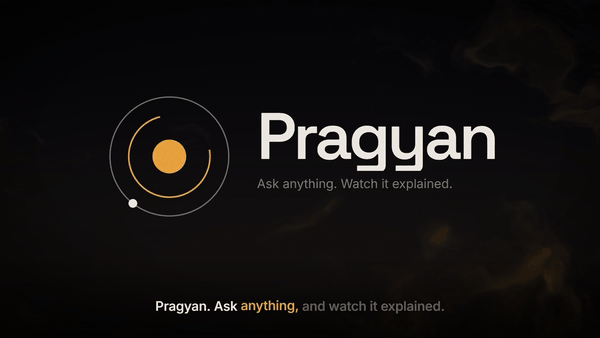

# Pragyan AI

### Ask anything. Watch it explained.

**A fully local, multi‑agent studio that turns a question, a maths problem, a photo of your homework, a PDF or your project notes into a narrated, animated explainer video — on one laptop, with zero cloud calls.**

<br/>


<br/><br/>

[**🎬 Watch the launch film**](docs/assets/pragyan-film.mp4) ·
[**⚡ Quick start**](#-quick-start) ·
[**🧠 Architecture**](#-architecture) ·
[**🤖 The agents**](#-meet-the-agents) ·
[**🎨 Motion library**](#-the-motion-library) ·
[**🖥️ Studio**](#%EF%B8%8F-the-studio)

</div>

<br/>

> **प्रज्ञान (Pragyan)** means *wisdom*. It is also the rover Chandrayaan‑3 landed on the Moon — hence the lunar basalt‑and‑saffron palette that runs through the whole project.

---

## 🎬 See it

<table>
<tr>
<td width="50%">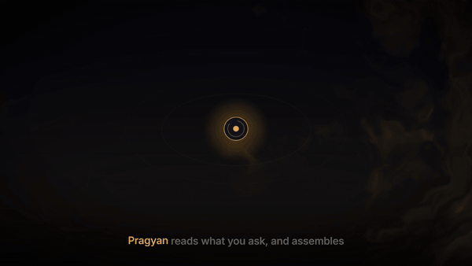<br/><sub><b>Agents spawning around the orchestrator</b> — from the hand‑directed launch film</sub></td>
<td width="50%">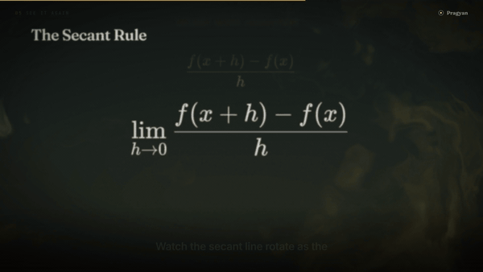<br/><sub><b>Manim written by a 9B local model</b> — secant becoming the tangent, composited on a live GLSL background</sub></td>
</tr>
<tr>
<td width="50%">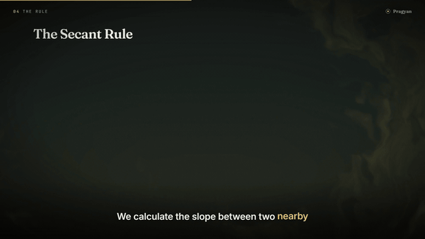<br/><sub><b>Derivation film‑strip</b> — each step rises, shrinks and dims as the next arrives, synced to narration</sub></td>
<td width="50%">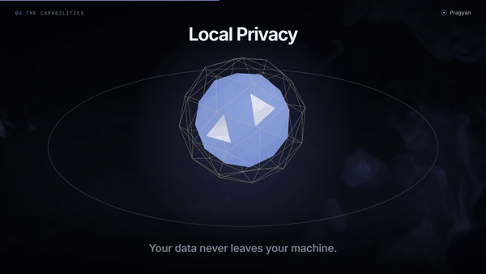<br/><sub><b>Real 3D (React Three Fiber)</b> — a concept core with ideas orbiting, labels projected from 3D</sub></td>
</tr>
</table>

<div align="center">

### Frames from videos Pragyan made by itself

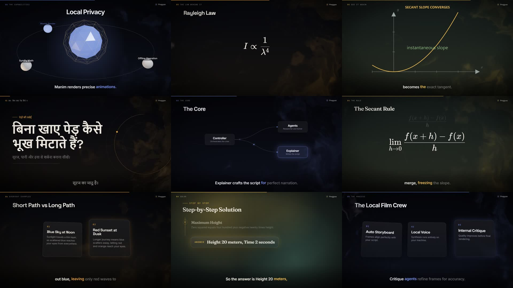

<sub>Product pitch · Rayleigh scattering · derivative (Manim) · <b>Hindi</b> photosynthesis · system diagram · limit definition · comparison cards · verified physics solution · feature cards</sub>

</div>

---

## ✨ What it does

```text
 "Why is the sky blue but sunsets are red?"           ─┐
 "Solve ∫₀¹ x·eˣ dx and explain every step"             │
 📷 a photo of a homework problem                       ├──►  🎞️  1080p MP4  +  captions (SRT/VTT)
 📄 a PDF / lecture notes / a code file                  │        +  chapters  +  transcript  +  storyboard
 "Pitch my project: …"                                  ─┘        +  interactive quiz  +  editable scenes
```

| | |
|---|---|
| 🧭 **Understands** | recognises intent (explain · solve · compare · summarise · pitch · story · how‑to · code · revision), domain and audience |
| 🧪 **Solves & verifies** | a solver writes SymPy that re‑computes its own answer; a sandbox runs it; mismatches trigger a re‑solve |
| 🎬 **Directs** | a creative director storyboards the film, guided by *steering packs* (reusable direction, not prompts) |
| 🎨 **Designs** | one designer agent per scene picks from 19 cinematic visuals; every on‑screen item gets its own narration line |
| ✂️ **Cuts for time** | a film editor projects the runtime and trims narration so a 60 s request lands at ~60 s |
| 🗣️ **Narrates** | Kokoro‑82M voices in English, Hindi, Spanish, French… with word‑level captions |
| 📐 **Animates** | Manim scenes are written, rendered, debugged and fixed in a loop that *remembers* past fixes |
| 👁️ **Reviews itself** | a vision critic inspects a frame of every scene and sends bad ones back to their designer |
| 📈 **Learns your taste** | rate a video 4–5 and it distils a new reusable steering pack |

---

## 🧠 Architecture

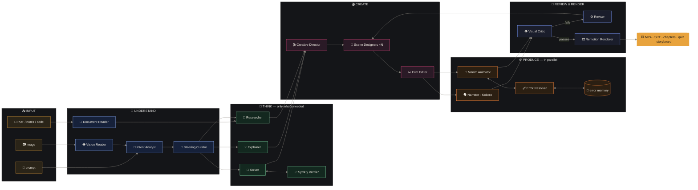

### The life of one job

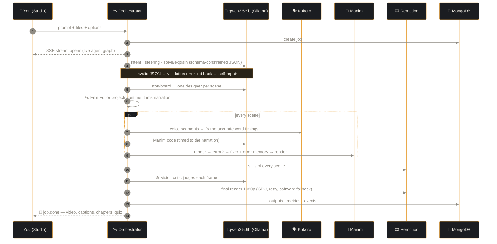

---

## 🤖 Meet the agents

| | Agent | What it does | Notable trick |
|:-:|---|---|---|
| 🛰️ | **Orchestrator** | runs the stages, spawns only the specialists the request needs | every agent is an `AgentRun` streamed live to the UI |
| 👁️ | **Vision Reader** | reads images — transcribes text and maths as LaTeX, spots problems | same `qwen3.5:9b` (it has vision) |
| 📑 | **Document Reader** | extracts PDFs, notes and code | — |
| 🎯 | **Intent Analyst** | intent · domain · audience · key question · which agents to spawn | deterministic guard‑rails on top of the model's choice |
| 🧲 | **Steering Curator** | retrieves and merges steering packs | rules + `nomic-embed-text` similarity |
| 🧮 | **Solver** | step‑by‑step solution with LaTeX | thinking mode with a runaway cap → falls back to a direct answer |
| ✅ | **Verifier** | runs the solver's SymPy in an AST‑checked sandbox | numeric/symbolic match, else an LLM judge |
| 💡 | **Explainer** | hook, intuition, analogy, mechanism, formula, takeaways | never invents numbers |
| 🔎 | **Researcher** | faithful digest of attached material | — |
| 🎬 | **Creative Director** | the whole storyboard before any scene is designed | validated: no repeated visuals, runtime budget, scene cap |
| 🎨 | **Scene Designer** ×N | fills one visual's schema; each item carries its own narration | soft lint + auto‑trim; sees the other scenes to avoid repetition |
| ✂️ | **Film Editor** | projects runtime and cuts over‑long scenes | calibrated on measured Kokoro speech rates |
| 🗣️ | **Narrator** | Kokoro‑82M → WAV + segment/word timings | thread‑safe; per‑sentence fallback |
| 📐 | **Manim Animator** | writes a scene timed to the narration | themed helper kit (`T`, `M`, `place`, `plot`, `sync`) |
| 🩹 | **Error Resolver** | fixes failing Manim code | shown the failing line; told when its last fix didn't work |
| 👁️ | **Visual Critic** | judges a still of every scene (and Manim clip frames) | renders without captions so it judges the scene |
| ♻️ | **Reviser** | redesigns scenes the critic rejected | one round, bounded |
| 🎞️ | **Renderer** | Remotion → H.264 1080p | GPU (ANGLE) → retry → SwiftShader |
| 🧬 | **Steering Distiller** | turns a 4–5★ video into a generic, reusable pack | pinned to the source video's intent |

---

## 💎 What's novel

<table>
<tr><td width="34%">

### 🧩 Constrained creativity
A 9B model can't write a premium motion system from scratch — but it is excellent at **choosing and filling** well‑shaped JSON. So the LLM picks from **19 curated visuals** using schema‑constrained decoding, and all the craft (springs, masks, depth, shaders, grain) lives in the library.

</td><td width="33%">

### 🔊 Narration‑synced reveals
Authoring schemas attach **one narration line to every on‑screen item**. Kokoro gives frame‑accurate timings, so item *k* appears exactly when the voice reaches it. Captions highlight word by word.

</td><td width="33%">

### 🔀 Hybrid engine routing
**Manim** for maths that must *move*; **Remotion** for everything else. Transparent Manim WebM composites straight onto the living GLSL background, so both engines feel like one film.

</td></tr>
<tr><td>

### 🩹 Self‑healing code with memory
Static AST checks → cheap auto‑fixes for hallucinated APIs → render → diagnose → fix. Every fix that works is stored in MongoDB as **error memory** and replayed for similar errors in later jobs.

</td><td>

### 🧮 Verified solving
The solver must emit SymPy that recomputes its answer. A sandbox runs it and a judge compares. The UI shows **"Checked with SymPy"** — or says honestly that it couldn't be checked.

</td><td>

### 👁️ Render → inspect → fix
The workflow human motion designers use, automated: render stills, look at them with a vision model, send failing scenes back. Then render the MP4.

</td></tr>
<tr><td>

### 🧲 Steering, not prompts
Reusable YAML packs describe **how** a kind of video is made — arc, visual vocabulary, voice, theme, rules — never the content. Retrieved per request, stacked with overlays (kids, exam revision).

</td><td>

### 📈 It learns your taste
Rate a video ★4–5 → the Distiller abstracts its structure into a new pack → future similar requests pick it up automatically.

</td><td>

### 🛡️ Never fails silently
Schema repair · soft lint · outline repair · Manim fallback layouts · token & time caps on every LLM call · per‑sentence TTS fallback · GPU→retry→software render. **The video always completes.**

</td></tr>
</table>

---

## 🔁 The self‑healing Manim loop

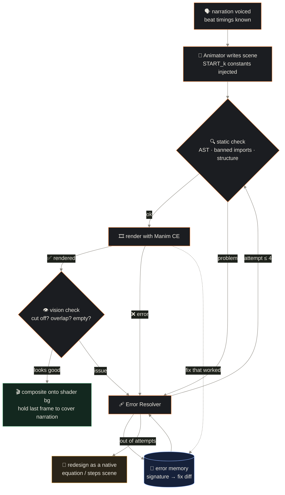

---

## ⏱️ How narration drives the picture

Every scene's timeline is built from the voice, not guessed:

```mermaid
%%{init: {'theme':'base','themeVariables':{'primaryColor':'#E8A33D','primaryTextColor':'#141518','sectionBkgColor':'#1b1d21','altSectionBkgColor':'#23262b','taskBkgColor':'#E8A33D','taskTextColor':'#141518','taskTextLightColor':'#ece8df','gridColor':'#3d4047','doneTaskBkgColor':'#8FB3FF','activeTaskBkgColor':'#7FD6A4','titleColor':'#8f8b83','textColor':'#8f8b83'}}}%%
gantt
    title One "bullets" scene — narration segments drive the reveals
    dateFormat X
    axisFormat %s
    section 🗣️ Voice
    intro line            :done, v0, 0, 3
    item 1 narration      :done, v1, 3, 7
    item 2 narration      :done, v2, 7, 11
    item 3 narration      :done, v3, 11, 15
    section 🎨 Screen
    heading reveals       :active, s0, 0, 15
    item 1 appears & glows:s1, 3, 15
    item 2 appears & glows:s2, 7, 15
    item 3 appears & glows:s3, 11, 15
    section 📝 Captions
    word‑by‑word highlight:c0, 0, 15
```

---

## 🧲 Steering packs

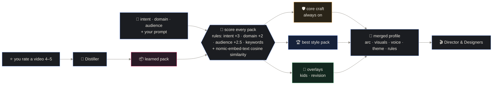

<table><tr>
<td>

| Pack | Theme | For |
|---|---|---|
| 🔬 Concept explainer | cosmos | why / how questions |
| 🧮 Problem solver | chalk | maths & physics problems |
| 📐 Maths concept | chalk | visual intuition, Manim‑first |
| 💻 Algorithm & code | neon | algorithms, code walkthroughs |
| 🧬 Life‑science process | solar | cycles, pathways, reactions |
| 📄 Document digest | paper | summaries of your PDFs |
| 🚀 Product launch film | midnight | pitches & hackathon demos |
| 🏛️ History & story | solar | events, biographies |
| ⚖️ Compare & decide | midnight | X vs Y |
| 🛠️ How‑to | cosmos | tutorials |
| 🧒 Overlay · young learners | solar | simpler words, slower pace |
| 📝 Overlay · exam revision | — | dense, fast, quiz |

</td>
<td>

```yaml
id: math-solver
name: Problem solver (maths & physics)
kind: pack
match:
  intents: [solve_problem]
  domains: [mathematics, physics]
  keywords: [solve, integral, derivative]
settings:
  theme: chalk
  voice: am_michael
  speed: 0.96
  manim: prefer
arc:
  - "hook: title - the problem as a question"
  - "givens: bullets - what we know"
  - "solve: steps - each step with its reason"
  - "see it: manim - make the answer visible"
  - "check: equation - substitute back"
  - "practice: quiz - a similar mini problem"
visuals:
  prefer: [steps, equation, manim]
  avoid:  [orbit3d, cards3d, stats]
rules:
  do: ["Use the verified final answer exactly."]
```

</td>
</tr></table>

---

## 🎨 The motion library

<div align="center">
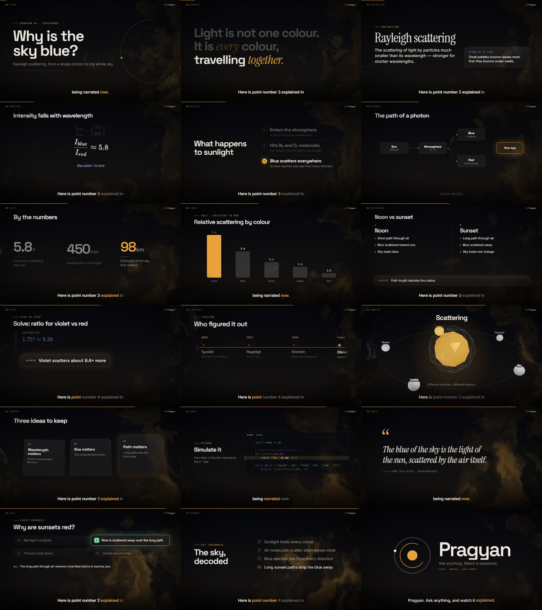
<sub>Every built‑in visual, rendered straight from the library's QA gallery composition</sub>
</div>

<br/>

| Visual | Motion idea | | Visual | Motion idea |
|---|---|---|---|---|
| 🏷️ `title` | masked word reveal, self‑drawing orbit mark | | 📊 `chart` | spring‑grown bars, self‑drawing line + area |
| 💥 `kinetic` | huge type slams in, earlier lines recede | | 💻 `code` | typed line by line, key line highlighted |
| 📋 `bullets` | focus follows the narration | | ❝ `quote` | serif italic words fade from blur |
| 📖 `definition` | serif term + glass analogy card | | 🖼️ `image` | Ken Burns + pinned annotations |
| ∑ `equation` | derivation film‑strip (KaTeX) | | 🕰️ `timeline` | camera pans along the events |
| 🪜 `steps` | camera scrolls to the active step | | 🪐 `orbit3d` | R3F icosahedron core, orbiting ideas |
| 🔀 `diagram` | auto‑layout DAG, drawn edges, travelling pulses | | 🃏 `cards3d` | 2.5D cards, active card comes forward |
| ⚖️ `comparison` | A vs B with a verdict | | 📐 `manim` | transparent clip over the shader |
| 🔢 `stats` | count‑ups with units | | ✅ `summary` · ❓ `quiz` | self‑drawn ticks · think‑timer + reveal |

**Finishing on every frame:** a GLSL domain‑warped noise background · film grain · vignette · slow camera drift · "dip‑through‑background" transitions (blur, rise, zoom, wipe) · word‑synced captions · chapter label and progress hairline.

### 🎨 Themes

| Theme | Background | Accent | Second | Mood |
|---|---|---|---|---|
| **cosmos** |  |  |  | Pragyan house style — lunar basalt + saffron |
| **midnight** |  |  |  | tech, product, launches |
| **chalk** |  |  |  | blackboard maths & physics |
| **paper** |  |  |  | editorial light mode, documents |
| **neon** |  |  |  | code & algorithms |
| **solar** |  |  |  | history, biology, stories |

### 🌏 Multilingual, script‑aware

Narration **and** on‑screen text in English · हिन्दी · Español · Français (Kokoro voices for many more). On non‑Latin scripts the library drops letter‑spacing, uppercasing and synthetic italics (they break Devanagari conjuncts), gives reveal masks room for vowel signs, and localises its own labels (`परिभाषा`, `मुख्य बातें`, `खुद को परखें`…).

---

## 🖥️ The Studio

<table>
<tr><td colspan="2">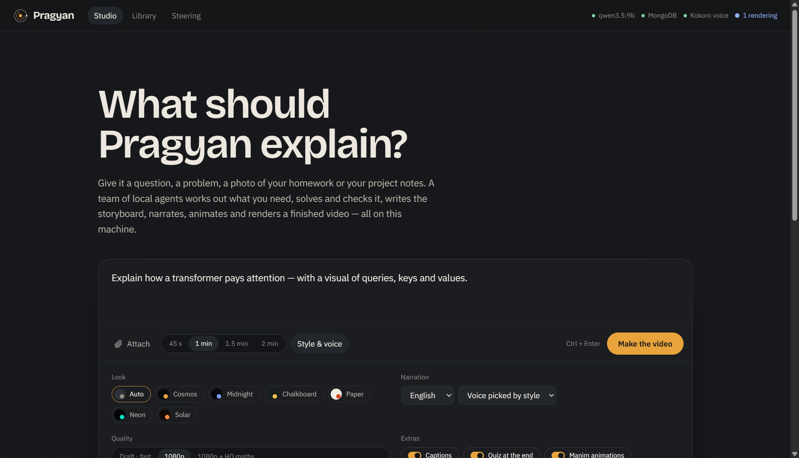<br/><sub><b>Composer</b> — prompt, drag‑and‑drop images / PDFs / code, length, look, voice, language, quality, extras</sub></td></tr>
<tr><td colspan="2">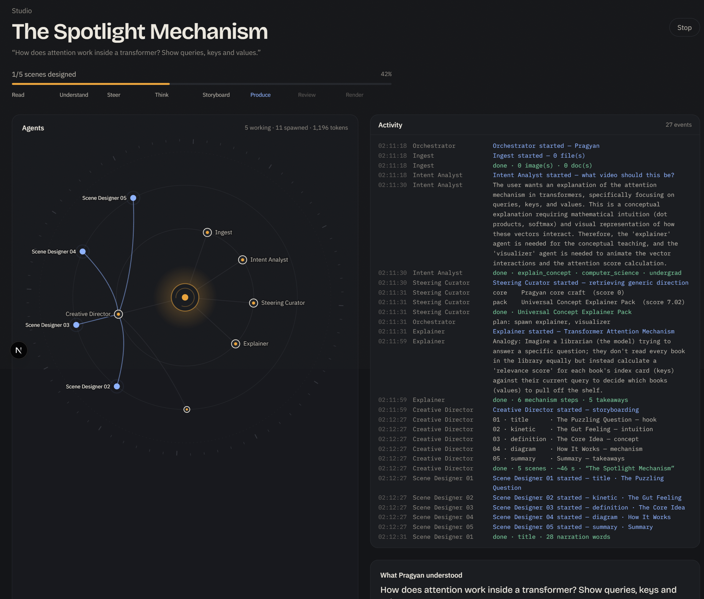<br/><sub><b>Mission control</b> — the live agent constellation (working agents pulse blue), the machine log, what Pragyan understood, the steering it applied (here a pack it <i>learned</i> from a rating), and the storyboard filling in</sub></td></tr>
<tr>
<td width="50%">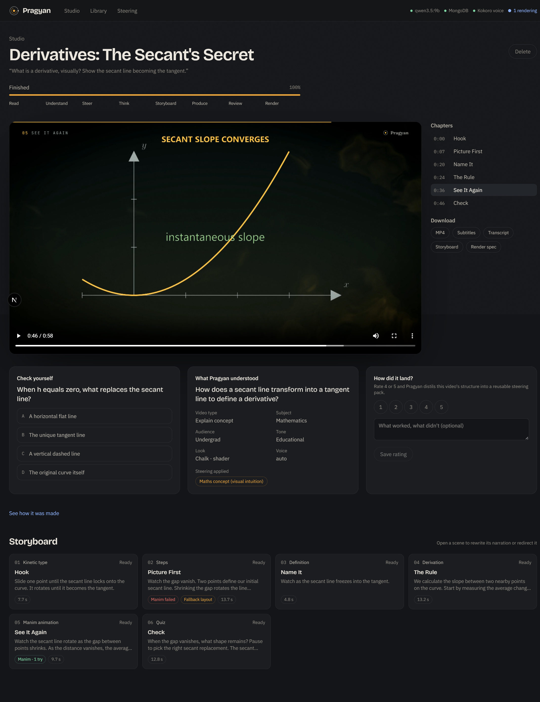<br/><sub><b>Finished film</b> — player with captions, chapters that follow playback, downloads, interactive quiz, rating → learning</sub></td>
<td width="50%">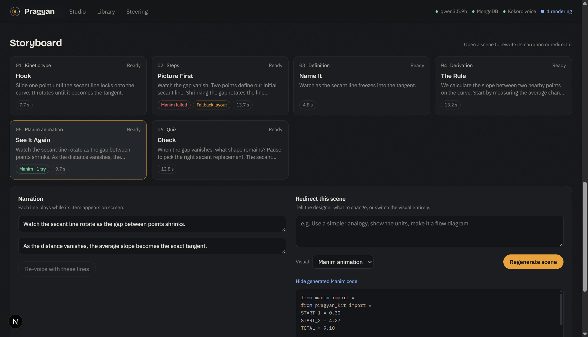<br/><sub><b>Human in the loop</b> — rewrite any narration line (re‑voiced), redirect a scene in plain words, switch its visual, inspect the generated Manim code</sub></td>
</tr>
<tr>
<td width="50%">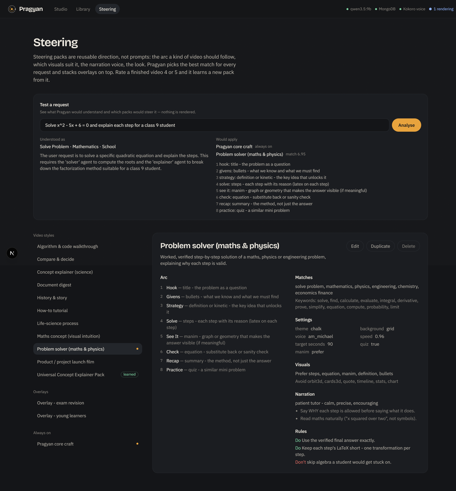<br/><sub><b>Steering</b> — dry‑run any request, browse / edit / duplicate packs, see learned ones</sub></td>
<td width="50%">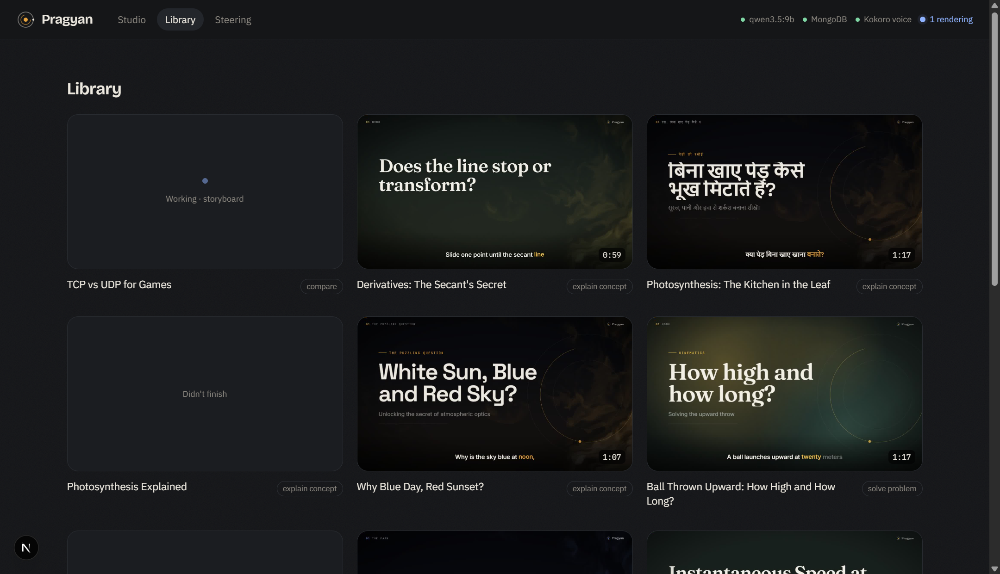<br/><sub><b>Library</b> — every film with poster, runtime and video type</sub></td>
</tr>
</table>

---

## 📊 Real numbers (RTX 5070 Laptop 8 GB · 24‑thread CPU)

| Measurement | Result |
|---|---|
| 🎯 Length accuracy after the Film Editor | **60 s requested → 61.6 s** · **60 s → 58.9 s** (was 138 s before) |
| 🧠 LLM throughput (`qwen3.5:9b` Q4_K_M) | ~34 tokens/s, schema‑constrained JSON |
| 🗣️ Kokoro‑82M on CPU (tuned, 12 threads) | ~0.85× real time |
| 🧮 SymPy verification | crash → re‑solve → **verified 9/2** · photo problem → **verified 20 m, 2 s** |
| 📐 Manim self‑healing | 4‑attempt recovery observed; unrecoverable scenes fall back cleanly |
| 🎞️ 60 s draft video, end to end | ~5 min |

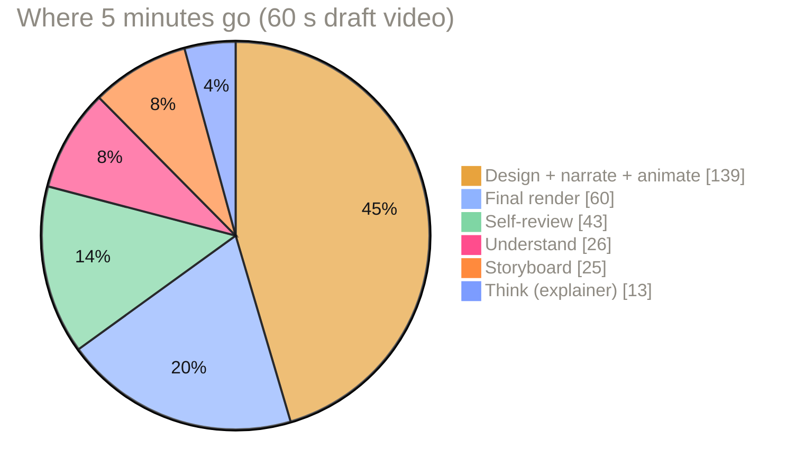

---

## ⚡ Quick start

```powershell
git clone https://github.com/Kamalllx/pragyan.git
cd pragyan
.\setup.ps1      # once — Python venv, npm installs, Kokoro voice, Ollama models, LaTeX auto-install
.\start.ps1      # API on :8000 · Studio on :3100 · opens the browser
```

**Needs:** Windows 10/11 (macOS/Linux work with the equivalent commands) · Python 3.12 · Node 20+ · ffmpeg · [Ollama](https://ollama.com) · MiKTeX / TeX Live (for Manim's LaTeX) · a GPU with ~8 GB VRAM.

```bash
ollama pull qwen3.5:9b          # reasoning + code + vision, one model
ollama pull nomic-embed-text    # steering retrieval
```

Optional `.env` (see [`.env.example`](.env.example)): `MONGODB_URI` — jobs, steering packs, error memory and feedback live in database `pragyan_ai`; without it Pragyan uses a local JSON store.

---

## 🗂️ Repository map

```text
pragyan/
├── 🐍 backend/pragyan/
│   ├── main.py              FastAPI · jobs · SSE events · edits · feedback · steering · system
│   ├── pipeline.py          the orchestrator: stages, parallel scenes, editor, review, render, edits
│   ├── llm.py               Ollama client: schema-constrained calls, validate-and-repair, runaway caps
│   ├── steering.py          load · score · merge · learn packs
│   ├── spec.py              pydantic schemas + per-visual authoring schemas → renderer visuals
│   ├── prompts.py           every agent prompt
│   ├── agents/              understand · knowledge · director · editor · animator · critic · distiller
│   └── engines/             tts (Kokoro) · manim_runner + manim_kit · sandbox · remotion_runner · media
├── 🎞️ motion/               Remotion project — the motion library
│   ├── src/components/      19 visuals (text, lists, data, math, diagram, code, media, orbit3d, quiz)
│   ├── src/fx/              GLSL shader background, grain, vignette, particles, grid
│   ├── src/film/            the hand-directed "Pragyan" launch film
│   └── scripts/render.mjs   cached bundle + render/stills CLI with JSON-lines progress
├── 🖥️ web/                  Next.js 16 Studio — composer, mission control, library, steering
├── 🧲 steering/             core/ · packs/ (styles + overlays) · learned/ (from your ratings)
├── 📚 docs/assets/          screenshots, GIFs, launch film
├── setup.ps1 · start.ps1
└── .env.example
```

---

## 🔌 API

| Method | Endpoint | |
|---|---|---|
| `POST` | `/api/jobs` | multipart: `prompt`, `options` (JSON), `files[]` → `{id}` |
| `GET` | `/api/jobs/{id}/events` | **SSE** live stream (history replayed on connect) |
| `GET` | `/api/jobs` · `/api/jobs/{id}` | library · full job |
| `POST` | `/api/jobs/{id}/scenes/{i}/regenerate` | redirect one scene in plain words / switch visual |
| `PATCH` | `/api/jobs/{id}/scenes/{i}` | replace narration lines → re‑voice → re‑render |
| `POST` | `/api/jobs/{id}/rerender` | change theme / background / captions / quality |
| `POST` | `/api/jobs/{id}/feedback` | rating (+ learn a steering pack) |
| `GET POST DELETE` | `/api/steering` | packs CRUD |
| `POST` | `/api/steering/preview` | dry run: intent + packs that would apply |
| `POST` | `/api/film/render` | render the launch film |
| `GET` | `/api/system` | models, engines, DB mode, running jobs |

Interactive docs at `http://127.0.0.1:8000/docs`.

---

## 🧱 Extending

- **New visual** → component in `motion/src/components` + register in `SceneRenderer.tsx` & `spec.ts` → authoring schema + `to_visual` branch in `backend/pragyan/spec.py` → one line in `prompts.DESIGNER_EXTRA`.
- **New steering pack** → drop a YAML in `steering/packs/` or *Steering → Duplicate* in the Studio.
- **Different models** → `MODEL_REASON`, `MODEL_CODE`, `MODEL_VISION` in `.env` (e.g. `qwen2.5-coder:7b` for Manim, `llava:7b` for vision).

---

## 🎥 Making motion design with Claude Code

The viral "Claude made this motion graphic" videos aren't *just* Remotion — they're **Claude Code acting as creative director and engineer over a stack of free renderers**:

| Layer | Free tools | Use it for |
|---|---|---|
| ⏱️ Timeline + render | **Remotion**, Motion Canvas / Revideo | product films, kinetic type, UI motion |
| ∑ Maths | **Manim CE** | equations that morph, graphs, geometry |
| 🧊 Real 3D | **Three.js / React Three Fiber**, Blender `bpy` | cameras, lights, particles, 2.5D depth |
| ✨ Look | **GLSL shaders**, grain, vignette, `@remotion/noise` | the "premium" feel |
| 🌀 Motion feel | springs, custom béziers, staggered choreography | cinematic vs "slide‑in" |
| 🔊 Post | **ffmpeg**, Kokoro / Piper TTS | audio, captions, muxing |

**The workflow:** storyboard first → build a motion vocabulary once → compose shots → **render stills, look at them, fix, repeat** → spend boldness in one place per shot. That's exactly how [`motion/src/film/PragyanFilm.tsx`](motion/src/film/PragyanFilm.tsx) was made:

```powershell
cd motion; node scripts/render.mjs --composition PragyanFilm --out ../storage/film/pragyan-film.mp4
npm run studio     # scrub every composition live in Remotion Studio
```

> A prompt that works: *"Act as the creative director and motion engineer. Read my project docs, write a 60‑second storyboard (8 shots: purpose, composition, camera move, timing), define a motion language, implement it in Remotion with R3F where depth helps, a GLSL background and spring choreography. Render a still from every shot, inspect them, fix weak shots, iterate, then render the MP4."*

---

## 🛣️ Roadmap

- [ ] Live Remotion Player preview of the storyboard before rendering
- [ ] Per‑language speech‑rate calibration for the Film Editor
- [ ] Background music bed + SFX on transitions
- [ ] More Manim kit helpers (vectors, number lines, 3D surfaces)
- [ ] Multi‑GPU / `OLLAMA_NUM_PARALLEL` for faster scene design

---

<div align="center">

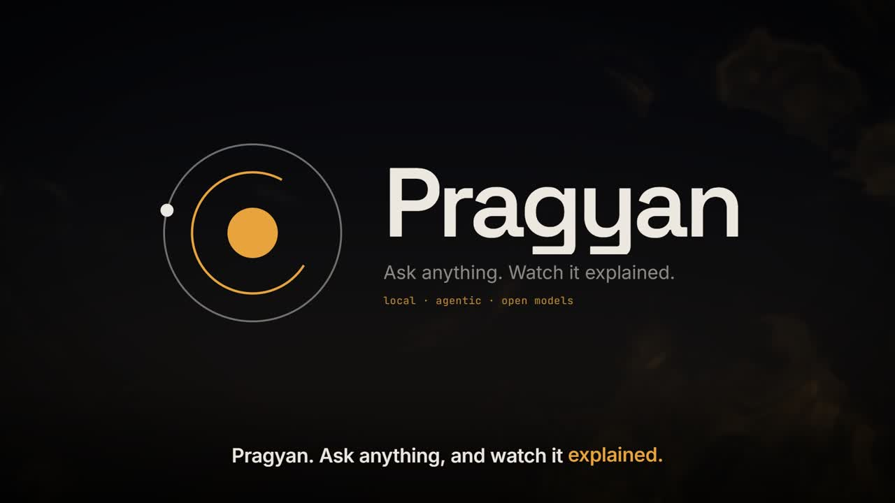

**Built with open models on one laptop.**
<br/>
<sub>Remotion is free for individuals and companies of up to 3 people; larger companies need a licence. Manim, Three.js, Kokoro, Ollama and the Qwen models are open source.</sub>

</div>
